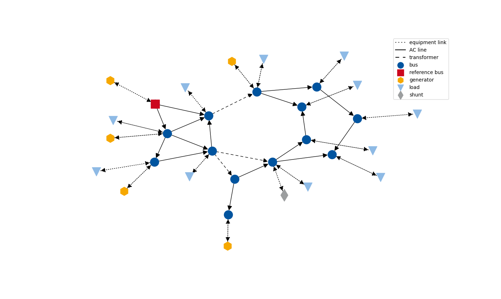

# opf-dataset-utils

[]([https://github.com/dwyl/esta/issues](https://github.com/viktor-ktorvi/opf-dataset-utils/issues))
<hr>

In this package we provide utils to support working with the
[OPFDataset](https://pytorch-geometric.readthedocs.io/en/latest/generated/torch_geometric.datasets.OPFDataset.html#torch_geometric.datasets.OPFDataset).

We implement:

* Efficient OPF related calculations to be used as metrics or in a physics informed setting:
    * Power Flow errors
    * Branch powers
    * Costs
    * Inequalities
* OPF specific [TorchMetrics](https://lightning.ai/docs/torchmetrics/stable/) metrics
* Data visualization
* Enums for indexing the OPFData JSON format
* And more...

## Contributing

Any sort of contribution or feedback is very welcome!

## Installation

### Requirements

Requires [_PyTorch_](https://pytorch.org/get-started/locally/) (any [version](https://pytorch.org/get-started/previous-versions/)
supported by PyTorch Geometric) and [_PyTorch Geometric_](https://pytorch-geometric.readthedocs.io/en/latest/install/installation.html) (>=2.6.0)
including it's optional dependencies (`pyg_lib`, `torch_scatter`, `torch_sparse`, `torch_cluster`, and `torch_spline_conv`).

May require installing _graphviz_ for visualization purposes.

### From PyPI

Install latest release from PyPI:
```
pip install opf_dataset_utils
```

### Directly from GitHub

Install the latest version directly from GitHub:
```
pip install git+https://github.com/viktor-ktorvi/opf-dataset-utils.git
```

## Usage

### Plotting

See [scripts/draw.py](scripts/draw.py) for a full example.

```python
from opf_dataset_utils.plotting.draw import draw_graph

draw_graph(dataset[0], ax=ax, node_size=300)
```

<p align="center">

</p>

### OPF calculations

#### Power flow errors

See [scripts/power_flow_errors.py](scripts/power_flow_errors.py) for a full example.

```python
from opf_dataset_utils.errors.power_flow import calculate_power_flow_errors
from opf_dataset_utils.metrics.power_flow import PowerFlowError

with torch.no_grad():
  untrained_predictions = untrained_model(batch.x_dict, batch.edge_index_dict)

# calculate errors
mean_abs_errors_solution = calculate_power_flow_errors(batch, batch.y_dict).abs().mean()
mean_abs_errors_untrained = calculate_power_flow_errors(batch, untrained_predictions).abs().mean()

# create torchmetrics Metrics
mean_apparent_pu_metric = PowerFlowError(aggr="mean", power_type="apparent", unit="per-unit")
max_active_mega_metric = PowerFlowError(aggr="max", power_type="active", unit="mega")
min_reactive_kilo_metric = PowerFlowError(aggr="min", power_type="reactive", unit="kilo")

# update metrics
mean_apparent_pu_metric(batch, untrained_predictions)
max_active_mega_metric(batch, untrained_predictions)
min_reactive_kilo_metric(batch, untrained_predictions)
# ...
```
Example results:
```
Mean power flow errors:
	Solution: 1.28563e-06 [p.u.]
	Untrained model prediction: 413350.84375 [p.u.]

...
```

#### Costs

See [scripts/costs.py](scripts/costs.py) for a full example.

```python
from opf_dataset_utils.costs import (
    calculate_costs_per_generator,
    calculate_costs_per_grid,
)

costs_per_grid = calculate_costs_per_grid(data, data.y_dict)
costs_per_generator = calculate_costs_per_generator(data, data.y_dict)
```

Example results:

```
Costs per grid [$/h]:
tensor([7564.9541, 8622.5996, 7247.7939, 7504.3018, 8446.8887, 7478.8228,
        8023.4907], device='cuda:0')
Costs per generator [$/h]:
tensor([4003.2192, 3561.7349,    0.0000,    0.0000,    0.0000,    0.0000,
        4035.1089, 4587.4902,    0.0000,    0.0000,    0.0000,    0.0000,
        3992.6309, 3255.1628,    0.0000,    0.0000,    0.0000,    0.0000,
        4005.5452, 3498.7563,    0.0000,    0.0000,    0.0000,    0.0000,
        4045.0081, 4401.8809,    0.0000,    0.0000,    0.0000,    0.0000,
        3994.2031, 3484.6196,    0.0000,    0.0000,    0.0000,    0.0000,
        4021.5444, 4001.9463,    0.0000,    0.0000,    0.0000,    0.0000],
       device='cuda:0')
```

#### Inequality violations

See [scripts/inequality_errors.py](scripts/inequality_errors.py) for a full example.

```python
from opf_dataset_utils.enumerations import EdgeTypes
from opf_dataset_utils.errors.inequality.voltage import calculate_upper_voltage_angle_difference_errors
from opf_dataset_utils.errors.inequality.generator_power import calculate_lower_active_power_errors

upper_voltage_angle_violations_transformer = calculate_upper_voltage_angle_difference_errors(data, data.y_dict, EdgeTypes.TRANSFORMER)
lower_active_power_generation_violations = calculate_lower_active_power_errors(data, data.y_dict)
# etc.
```

Example results:

```
Worst case violations:

Solution:

Upper Vm:                         1.1920928955078125e-07 [p.u.]                   
Lower Vm:                                            0.0 [p.u.]                   
Upper Va diff. (transformers):                       0.0 [rad]                    
Upper Va diff. (AC lines):                           0.0 [rad]                    
Lower Va diff. (transformers):                       0.0 [rad]                    
Lower Va diff. (AC lines):                           0.0 [rad]                    
Upper Pg:                                            0.0 [p.u.]                   
Lower Pg:                          9.985742011053844e-09 [p.u.]                   
Upper Qg:                                            0.0 [p.u.]                   
Lower Qg:                                            0.0 [p.u.]                   
Upper S_ij (transformers):                           0.0 [p.u.]                   
Upper S_ij (AC lines):                               0.0 [p.u.]                   
Upper S_ji (transformers):                           0.0 [p.u.]                   
Upper S_ji (AC lines):                               0.0 [p.u.]                   

Untrained model:

Upper Vm:                             112.72354125976562 [p.u.]                   
Lower Vm:                             306.87078857421875 [p.u.]                   
Upper Va diff. (transformers):                       0.0 [rad]                    
Upper Va diff. (AC lines):            1149.0396728515625 [rad]                    
Lower Va diff. (transformers):         124.8240737915039 [rad]                    
Lower Va diff. (AC lines):             686.0045776367188 [rad]                    
Upper Pg:                                            0.0 [p.u.]                   
Lower Pg:                              33.55585479736328 [p.u.]                   
Upper Qg:                             0.1578141152858734 [p.u.]                   
Lower Qg:                              157.2376708984375 [p.u.]                   
Upper S_ij (transformers):                  417092.96875 [p.u.]                   
Upper S_ij (AC lines):                        2345705.25 [p.u.]                   
Upper S_ji (transformers):              10831.6123046875 [p.u.]                   
Upper S_ji (AC lines):                        3082554.75 [p.u.]                   

Process finished with exit code 0

```

#### Branch power flows

See [scripts/branch_powers.py](scripts/branch_powers.py) for a full example.

```python
from opf_dataset_utils.enumerations import EdgeTypes
from opf_dataset_utils.power import calculate_branch_powers

ac_line_powers_from, ac_line_powers_to = calculate_branch_powers(batch, batch.y_dict, EdgeTypes.AC_LINE)
transformer_powers_from, transformer_powers_to = calculate_branch_powers(batch, batch.y_dict, EdgeTypes.TRANSFORMER)
```

Example results:

```
AC line power flows [p.u.]:
tensor([ 1.9860e+00-0.0678j,  8.5920e-01+0.0821j,  7.7557e-01-0.0108j,
         5.6563e-01-0.0239j,  4.0300e-01+0.0017j, -2.6185e-01+0.1008j,
        -6.7861e-01+0.1603j,  8.0781e-02+0.0468j,  8.7156e-02+0.0244j,
         1.9349e-01+0.0730j,  2.4476e-07-0.1052j,  2.9223e-01+0.0275j,
         5.5007e-02+0.0391j,  9.9253e-02+0.0241j, -4.9108e-02-0.0280j,
         1.5681e-02+0.0090j,  6.4659e-02+0.0209j], device='cuda:0')


Transformer line power flows [p.u.]:
tensor([0.2922-0.0601j, 0.1681+0.0037j, 0.4683+0.1187j], device='cuda:0')
```

#### Etc.

### Metrics

All of the above calculations can be encapsulated in TorchMetrics metrics. 
See [scripts/metrics.py](scripts/metrics.py) for a full example.

```python
from opf_dataset_utils.metrics.variable.voltage import VoltageMagnitudeError
from opf_dataset_utils.metrics.power_flow import PowerFlowError
from opf_dataset_utils.metrics.power import Power

metric1 = VoltageMagnitudeError(aggr="max", value_type="absolute")
metric2 = PowerFlowError(aggr="mean", power_type="apparent", value_type="relative")
metric3 = Power(aggr="min", power_type="active", unit="kilo")
# ...
```

```
val/max absolute voltage magnitude error [per-unit]                        : 226.57712
val/mean relative apparent power flow error [%]                            : 48681344.00000
val/min active power [kVA]                                                 : -776817.87500
...
```
